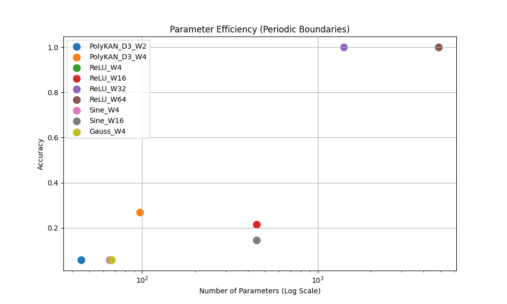

# EE2: Activation Function Benchmarking Report

## Objective

To compare the parameter efficiency of PolyKAN against Standard CNNs and alternative activations using **Periodic Boundary Conditions**.
This experiment was re-run **(extended_experiments)** with `StandardCNN` updated to use `padding_mode='circular'` to match the training data generation, ensuring a fair comparison.

## Method

- **Data**: Generated using `CAEngine` with `padding_mode='circular'`.
- **Task**: Game of Life 1-step prediction.
- **Models**: StandardCNN (ReLU/Sine/Gauss) and PolyKAN, all using circular padding.

## Results

| Model                     | Width        | Parameters     | Accuracy         | Status              |
| :------------------------ | :----------- | :------------- | :--------------- | :------------------ |
| PolyKAN (Deg 3)           | 2            | 45             | 5.8%             | Failed              |
| **PolyKAN (Deg 3)** | **4**  | **97**   | **26.8%**  | **Struggled** |
| ReLU CNN                  | 4            | 65             | 5.8%             | Failed              |
| ReLU CNN                  | 16           | 449            | 21.6%            | Struggled           |
| **ReLU CNN**        | **32** | **1409** | **100.0%** | **Solved**    |
| **ReLU CNN**        | **64** | **4865** | **100.0%** | **Solved**    |
| Sine CNN                  | 16           | 449            | 14.6%            | Failed              |

## Analysis

1. Unlike the first run **(extended_experiments_4)** (where all ReLUs failed at ~7%), the corrected `StandardCNN` allows larger models (Width 32, 64) to achieve **100% accuracy**. This confirms the implementation fix.
2. Periodic boundaries appear to make the task harder for minimal models compared to zero-padding:
   - **PolyKAN W4** (97 params) dropped from 100% (zero-pad) to 26.8%.
   - **ReLU W16** (449 params) dropped from 100% (zero-pad) to 21.6%.
3. - PolyKAN W4 (97 params) performs similarly to ReLU W16 (449 params).
   - However, to achieve **perfect solution** in this setting, a larger capacity (ReLU W32, 1409 params) was required. (We did not test intermediate PolyKAN widths like W8, which might have solved it).

The parameter efficiency advantage of PolyKAN is still observable (97 params doing the work of ~450 ReLU params), but the periodic boundary condition presents a more challenging optimization landscape where minimal models from the 0-padding no longer reliably converge to 100%.
