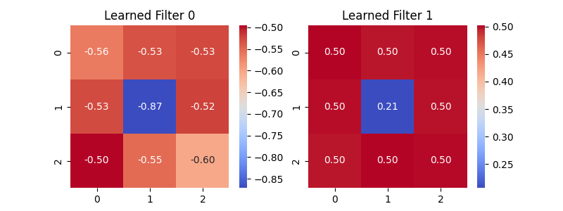
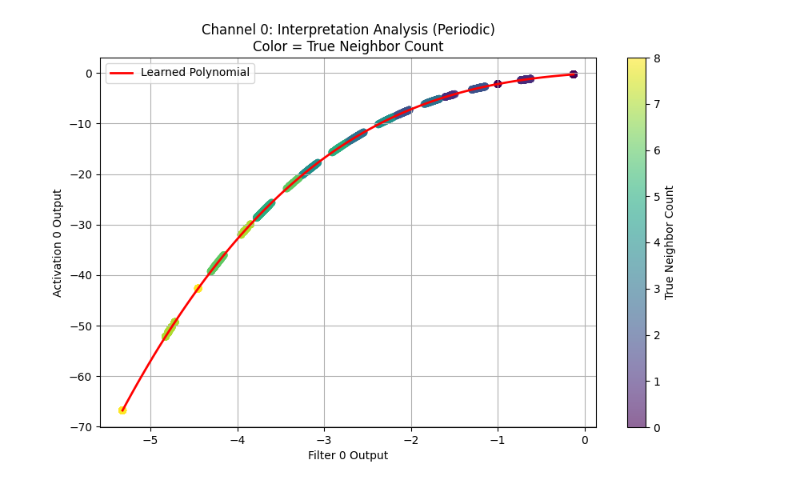
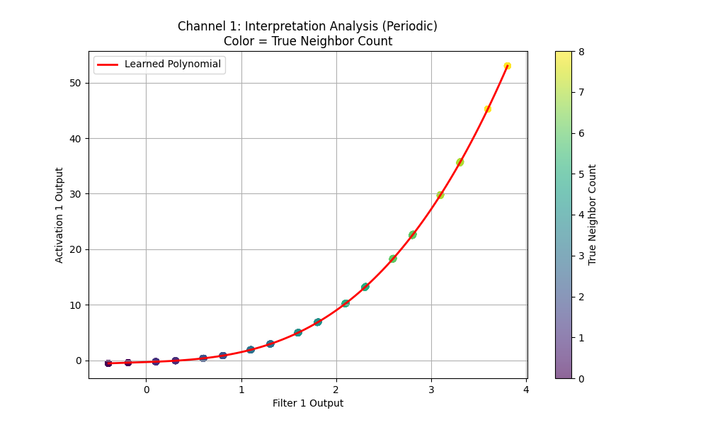

# EE2: Interpretability Analysis Report

## To verify if PolyKAN learns interpretable features using **Periodic Boundary Conditions**.

## Method

1. Train PolyKAN (Width 2, Degree 3) with circular padding to 100% acc.
2. Extract and visualize learned 3 x 3 conv kernels.
3. Create scatter plots: Filter Output v/s Activation Output, colored by ground-truth neighbor count.

## Results

### Learned Kernels

### Learned Activation Functions

The scatter plots reveal the network's internal representation:

## Analysis

- The scatter points form distinct vertical clusters corresponding to integer neighbor counts (0,1,2,...,8).
- The learned polynomial curves (red lines) show clear peaks or high values for neighbor counts that satisfy the birth/survival rules (e.g., 3 for birth, 2-3 for survival).
- Results are qualitatively similar to the zero-padding interpretability analysis, confirming that the learned functions are robust to boundary conditions.
- PolyKAN learns interpretable representations under periodic boundaries, reinforcing the previous findings.
