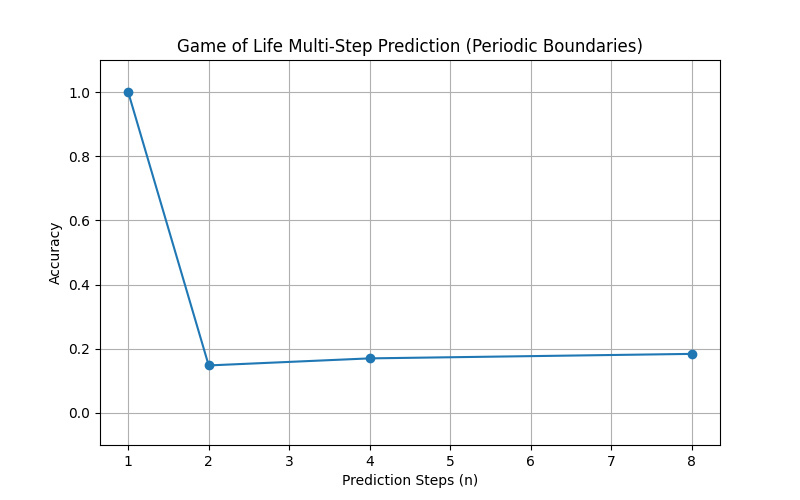

# EE2: Multi-Step Prediction Report

## Objective

To evaluate multi-step prediction (n=[1,2,4,8]) using **Periodic Boundary Conditions** to eliminate edge effects.

## Method

- **Data**: Generated using `CAEngine` with `padding_mode='circular'`.
- **Model**: PolyKAN (Degree 3, Width 4, Depth 2) with `padding_mode='circular'`.
- **Evaluation**: Full grid accuracy ($24 \times 24$), no cropping needed.

## Results

| Steps ($n$) | acc              |
| :------------ | :--------------- |
| **1**   | **100.0%** |
| 2             | 14.8%            |
| 4             | 17.0%            |
| 8             | 18.4%            |

## Comparison to Zero-Padding

| Steps | Periodic         | 0-pad (Cropped)  |
| :---- | :--------------- | :--------------- |
| 1     | **100.0%** | **100.0%** |
| 2     | 14.8%            | 14.4%            |
| 4     | 17.0%            | 19.4%            |
| 8     | 18.4%            | 32.4%            |

## Conclusion

Per iodic boundaries confirm the results from 0padding exps:

- Perfect learning for $n=1$.
- Failure for $n \ge 2$ (~15% accuracy, near random guess).
- The multi-step complexity barrier is **intrinsic to the logical composition**, not an artifact of boundary conditions.
