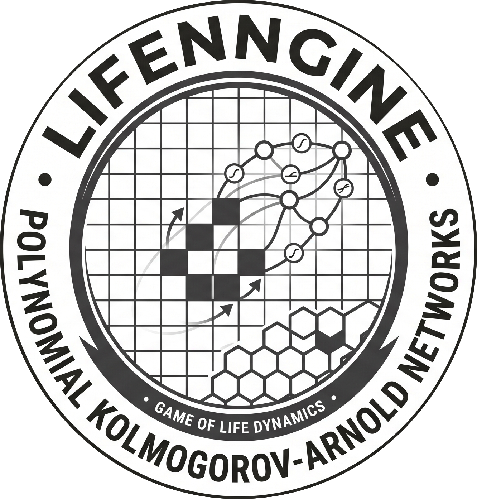

<p align="center">
  
</p>

<h1 align="center">LifeNNgine</h1>

<p align="center">
  <em>It's Much Easier for Neural Networks to Learn Game of Life Dynamics with the Right Activation Function</em>
</p>

<p align="center">
  
  
  
</p>

---

## Table of Contents

- [Overview](#overview)
- [Features](#features)
- [Installation](#installation)
- [Quick Start](#quick-start)
- [Project Structure](#project-structure)
- [Model Architecture](#model-architecture)
- [CLI Reference](#cli-reference)
- [Experiments](#experiments)
  - [Density Experiments](#density-experiments)
  - [Knockout / Ablation Experiments](#knockout--ablation-experiments)
  - [N-Step Prediction](#n-step-prediction)
- [Available Activations](#available-activations)
- [Notebooks](#notebooks)
- [License](#license)

---

## Overview

**LifeNNgine** (lllcann) is a research framework for training compact convolutional neural networks to learn and predict Cellular Automata (CA) dynamics - with a primary focus on Conway's Game of Life and other Life-like rules.

The project explores how minimal neural architectures (parameterised by depth _n_ and width _m_) can discover and replicate the update rules of binary cellular automata. It supports a wide range of activation functions - including learnable polynomial activations (**PolyKAN**) - and provides tools for systematic experimentation across density ranges, overcompleteness levels, and multi-step prediction tasks.

##### **The CA environment is powered by [CARLE](https://github.com/riveSunder/carle) (Cellular Automata Research Learning Environment).**

## Features

- **Multiple model architectures** - `ActNN` (standard activations), `PolyKAN` (learnable polynomial activations), and `MiniPolyKAN` (compact variant)
- **20+ activation functions** - ReLU, PReLU, SiLU, Gaussian, AdaptiveSigmoid, and more
- **Overcompleteness control** - scale model width with the _m_ parameter (L(1,1), L(1,2), L(1,4), …)
- **N-step prediction** - train networks to predict _n_ consecutive CA steps; network depth auto-adjusts
- **Density sweep experiments** - evaluate performance across varying initial cell densities
- **Knockout / ablation studies** - freeze weights or activation parameters independently
- **Early stopping** - halt training once the CA rule is perfectly learned
- **Experiment logging** - automatic CSV logging of results, parameters, and git hashes for reproducibility
- **Jupyter notebooks** - visualisations for rule learning, density analysis, parameter perturbations, and more

## Installation

### 1. Clone and set up a virtual environment

```bash
git clone git@github.com:TashinAhmed/LifeNNgine.git
cd LifeNNgine

python -m venv .venv
source .venv/bin/activate
```

### 2. Install dependencies

```bash
pip install -r requirements.txt
pip install -e .
```

### 3. Install CARLE (CA engine)

```bash
git clone git@github.com:riveSunder/carle.git
cd carle
pip install -e .
cd ..
```

> **Note:** The included `requirements.txt` is comprehensive. For a lighter install, the core dependencies are `torch`, `numpy`, `pandas`, `matplotlib`, and `scikit-learn`.

## Quick Start

Train a minimal L(1,1) model with ReLU activation to learn Conway's Game of Life (B3/S23):

```bash
python src/cann/train.py -d -s -e 12500 -l 0.001 -m 1 -r 128 -b 8 8 -c 0.38 -a ReLU -x quickstart_relu
```

This runs 128 repetitions of 12,500-epoch training with early stopping (`-s`), logging results (`-d`) to `results/quickstart_relu/`.

## Project Structure

```
LifeNNgine/
├── src/cann/
│   ├── train.py              # Entry point - CLI argument parsing and training loop
│   ├── perturb.py            # Parameter perturbation utilities
│   ├── visualise.py          # Visualisation utilities
│   └── models/
│       ├── base.py           # ActNN - base CNN architecture
│       ├── polykan.py        # PolyKAN & MiniPolyKAN models
│       ├── act.py            # Custom activations (PolynomialActivation, Gaussian, etc.)
│       └── minimal.py        # Minimal model variants
├── notebooks/                # Jupyter notebooks for analysis and visualisation
├── scripts/                  # Shell scripts for batch experiments
├── tests/                    # Unit tests
├── assets/                   # Images and media
├── pyproject.toml
├── setup.py
└── requirements.txt
```

## Model Architecture

### L(m, n) Notation

Models are described by the notation **L(m, n)**:

| Parameter                            | Meaning                                                                                                                                    |
| ------------------------------------ | ------------------------------------------------------------------------------------------------------------------------------------------ |
| **m** (width/overcompleteness) | Number of filter channels. 3×3 neighbourhood layers use `2m` channels; 1×1 dynamics layers use `m` channels.                         |
| **n** (depth/CA steps)         | Number of repeated_(3×3 conv → activation → 1×1 conv → activation)_ blocks. Automatically set to match the CA step prediction task. |

- **L(1,1)** — the minimal model: one block, one channel. Few enough parameters to enumerate the full parameter space.
- **L(1,2)** — 2× overcomplete in width, giving the network more capacity.
- **L(1,4)**, **L(1,8)**, … — further overcompleteness for investigating how capacity affects learning.

### Model Types

| Model           | Description                                                                                                                                                                                 |
| --------------- | ------------------------------------------------------------------------------------------------------------------------------------------------------------------------------------------- |
| `ActNN`       | Base architecture. Uses any standard or custom activation function. Each block: 3×3 conv → act → 1×1 conv → act, repeated `depth` times, followed by a 1×1 output conv and sigmoid. |
| `PolyKAN`     | Replaces fixed activations with `PolynomialActivation` — a learnable polynomial f(x) = Σ wᵢxⁱ of configurable degree.                                                                 |
| `MiniPolyKAN` | Compact PolyKAN variant with skip connections from the input into the dynamics layers.                                                                                                      |

All models use **circular padding** (toroidal boundary conditions) to match the CA environment.

## CLI Reference

The entry point for experiments is `src/cann/train.py`:

```
python src/cann/train.py [OPTIONS]
```

### Options

| Flag         | Argument             | Default         | Description                                                                            |
| ------------ | -------------------- | --------------- | -------------------------------------------------------------------------------------- |
| `-a`       | `ACTIVATION [...]` | `PolyKAN`     | Activation function(s). See [Available Activations](#available-activations).             |
| `--degree` | `INT`              | `2`           | Polynomial degree for PolyKAN/MiniPolyKAN.                                             |
| `-b`       | `BATCH MINIBATCH`  | `10000 8`     | Epoch batch size and minibatch size.                                                   |
| `-c`       | `DENSITY [...]`    | `0.5`         | Initial cell density. Pass a single value, or `min max step` for a range.            |
| `-d`       | —                   | `False`       | Enable logging to file.                                                                |
| `-e`       | `INT`              | `100`         | Number of training epochs.                                                             |
| `-l`       | `FLOAT`            | `0.001`       | Learning rate.                                                                         |
| `-m`       | `INT [...]`        | `1`           | Overcompleteness_m_ (model width).                                                     |
| `-n`       | `INT [...]`        | `1`           | CA steps for n-step prediction; also sets network depth.                               |
| `-o`       | —                   | `False`       | Enable loss weighting by cell-state frequency.                                         |
| `-p`       | `INT`              | `17`          | Base pseudorandom seed.                                                                |
| `-r`       | `INT`              | `1`           | Number of repetitions per experimental condition.                                      |
| `-s`       | —                   | `False`       | Enable early stopping (halts when grid accuracy = 100% for 2 consecutive evaluations). |
| `-t`       | —                   | `True`        | **Disable** training of activation parameters (knockout).                        |
| `-u`       | `STRING`           | `B3/S23`      | Life-like CA rulestring (e.g.,`B3/S23` for Conway's Game of Life).                   |
| `-v`       | `INT`              | `10`          | Display/log progress every N epochs.                                                   |
| `-w`       | —                   | `True`        | **Disable** training of neural weights (knockout).                               |
| `-x`       | `STRING`           | `default_exp` | Experiment name (used for results subdirectory).                                       |

## Experiments

### Density Experiments

Evaluate model performance across a range of initial cell densities:

```bash
# L(1,1) PolyKAN — full density sweep (0.05 to 0.95)
python src/cann/train.py -d -s -e 12500 -l 0.001 -m 1 -r 128 -b 8 8 \
    -c 0.05 1.0 0.05 -a PolyKAN -x density_polykan_l1_1

# L(1,1) PolyKAN — zoomed-in density sweep (0.20 to 0.50)
python src/cann/train.py -d -s -e 12500 -l 0.001 -m 1 -r 128 -b 8 8 \
    -c 0.2 0.51 0.01 -a PolyKAN -x density_polykan_l1_1_zoom

# L(1,2) PolyKAN — 2× overcomplete
python src/cann/train.py -d -s -e 12500 -l 0.001 -m 2 -r 128 -b 8 8 \
    -c 0.05 1.0 0.05 -a PolyKAN -x density_polykan_l1_2

# L(1,1) ReLU — full density sweep
python src/cann/train.py -d -s -e 125000 -l 0.001 -m 1 -r 128 -b 8 8 \
    -c 0.05 1.0 0.05 -a ReLU -x density_relu_l1_1

# L(1,1) ReLU — zoomed-in density sweep
python src/cann/train.py -d -s -e 125000 -l 0.001 -m 1 -r 128 -b 8 8 \
    -c 0.2 0.51 0.01 -a ReLU -x density_relu_l1_1_zoom

# L(1,2) ReLU — 2× overcomplete
python src/cann/train.py -d -s -e 125000 -l 0.001 -m 2 -r 128 -b 8 8 \
    -c 0.05 1.0 0.05 -a ReLU -x density_relu_l1_2
```

### Knockout / Ablation Experiments

Investigate the role of individual learnable components by freezing them:

```bash
# Freeze activation function coefficients
python src/cann/train.py -d -s -e 125000 -l 0.001 -m 1 -r 128 -b 8 8 \
    -a PolyKAN -t -x poly_act_knockout

# Freeze neural weights
python src/cann/train.py -d -s -e 125000 -l 0.001 -m 1 -r 128 -b 8 8 \
    -a PolyKAN -w -x poly_neuron_knockout

# PReLU — freeze activations
python src/cann/train.py -d -s -e 125000 -l 0.001 -m 1 -r 128 -b 8 8 \
    -a PReLU -t -x prelu_act_knockout

# PReLU — freeze weights
python src/cann/train.py -d -s -e 125000 -l 0.001 -m 1 -r 128 -b 8 8 \
    -a PReLU -w -x prelu_neuron_knockout
```

### N-Step Prediction

Train models to predict _n_ consecutive CA steps. Network depth automatically matches the number of steps:

```bash
# L(n,1) PolyKAN, n = 1..5
python src/cann/train.py -d -s -e 125000 -l 0.001 -m 1 -r 128 -b 8 8 \
    -c 0.38 -a PolyKAN -n 1 2 3 4 5 -x n12345_polykan_l1_1

# L(n,1) ReLU, n = 1..5
python src/cann/train.py -d -s -e 125000 -l 0.001 -m 1 -r 128 -b 8 8 \
    -c 0.38 -a ReLU -n 1 2 3 4 5 -x n12345_relu_l1_1

# L(n,2) PolyKAN, n = 1..5
python src/cann/train.py -d -s -e 125000 -l 0.001 -m 2 -r 128 -b 8 8 \
    -c 0.38 -a PolyKAN -n 1 2 3 4 5 -x n12345_polykan_l1_2

# L(n,2) ReLU, n = 1..5
python src/cann/train.py -d -s -e 125000 -l 0.001 -m 2 -r 128 -b 8 8 \
    -c 0.38 -a ReLU -n 1 2 3 4 5 -x n12345_relu_l1_2
```

> The same pattern extends to L(n,4), L(n,8), L(n,16), and L(n,32) by changing the `-m` value.

## Available Activations

The following activation functions can be passed to the `-a` flag:

| Activation                  | Key                 | Type                             |
| --------------------------- | ------------------- | -------------------------------- |
| **ReLU**              | `ReLU`            | Standard                         |
| **Leaky ReLU**        | `LeakyReLU`       | Standard                         |
| **Extra Leaky ReLU**  | `ExtraLeakyReLU`  | Standard (slope=0.25)            |
| **PReLU**             | `PReLU`           | Learnable                        |
| **NegPReLU**          | `NegPReLU`        | Learnable (init=−0.25)          |
| **CELU**              | `CELU`            | Standard                         |
| **ELU**               | `ELU`             | Standard                         |
| **GELU**              | `GELU`            | Standard                         |
| **SELU**              | `SELU`            | Standard                         |
| **SiLU**              | `SiLU`            | Standard                         |
| **Mish**              | `Mish`            | Standard                         |
| **Tanh**              | `Tanh`            | Standard                         |
| **Sigmoid**           | `Sigmoid`         | Standard                         |
| **Softplus**          | `Softplus`        | Standard                         |
| **Softsign**          | `Softsign`        | Standard                         |
| **Gaussian**          | `Gaussian`        | Custom - exp(−x²/2)            |
| **Adaptive Gaussian** | `AGaussian`       | Learnable - exp(−(x−b)²/2c²) |
| **Square**            | `Square`          | Custom - x²                     |
| **Root Square**       | `RootSquare`      | Custom - √(x²)                 |
| **Adaptive Sigmoid**  | `AdaptiveSigmoid` | Learnable                        |
| **PolyKAN**           | `PolyKAN`         | Learnable polynomial             |
| **MiniPolyKAN**       | `MiniPolyKAN`     | Learnable polynomial (compact)   |

## Notebooks

The `notebooks/` directory contains Jupyter notebooks for analysing and visualising experimental results:

| Notebook                          | Description                                   |
| --------------------------------- | --------------------------------------------- |
| `density.ipynb`                 | Density sweep analysis and visualisation      |
| `knockout_experiments.ipynb`    | Ablation study results                        |
| `life_like.ipynb`               | Experiments with different Life-like CA rules |
| `minimal_success_rates.ipynb`   | Success rate analysis for minimal models      |
| `overcompleteness.ipynb`        | Effect of overcompleteness on learning        |
| `parameter_perturbations.ipynb` | Parameter sensitivity analysis                |
| `parameter_space.ipynb`         | Parameter space exploration (PCA)             |
| `prelu_monotony.ipynb`          | PReLU monotonicity analysis                   |
| `rule_viz.ipynb`                | Visualisation of learned CA rules             |
| `success_table.ipynb`           | Summary success rate tables                   |

## License

This project is licensed under the [MIT License](LICENSE).

Copyright © 2026 Tashin Ahmed & Q. Tyrell Davis
