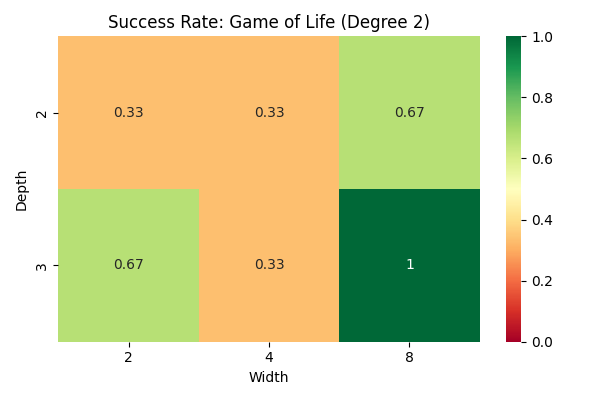
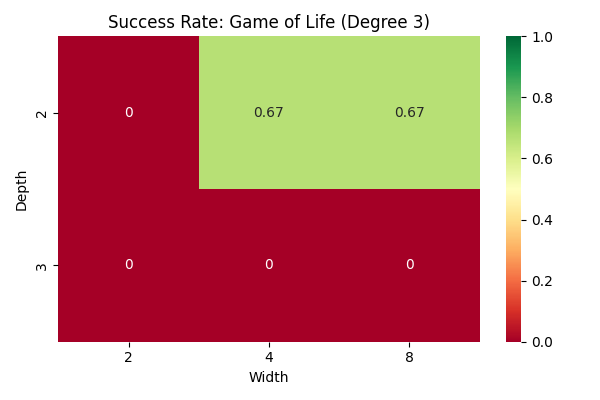
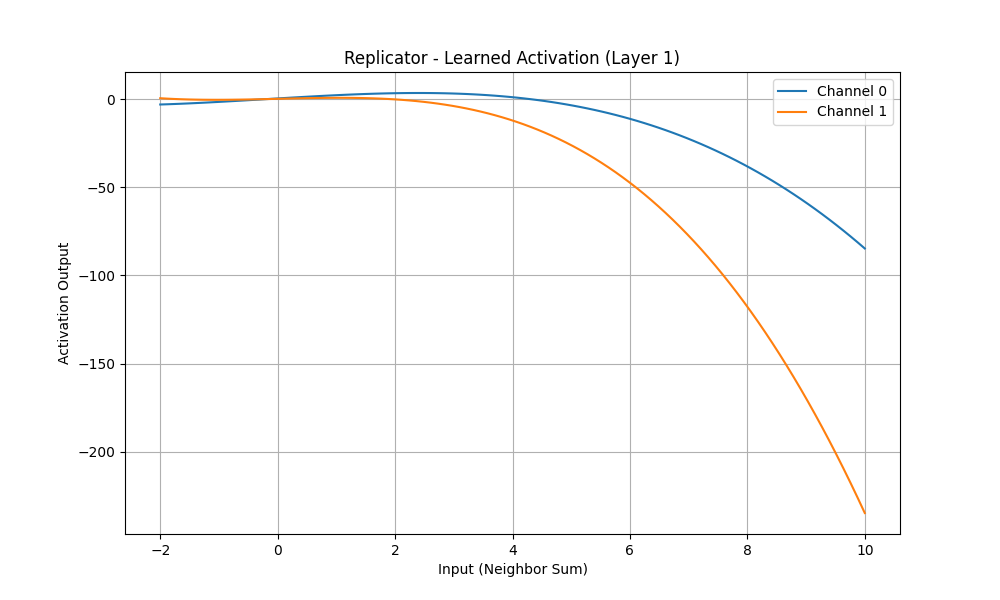
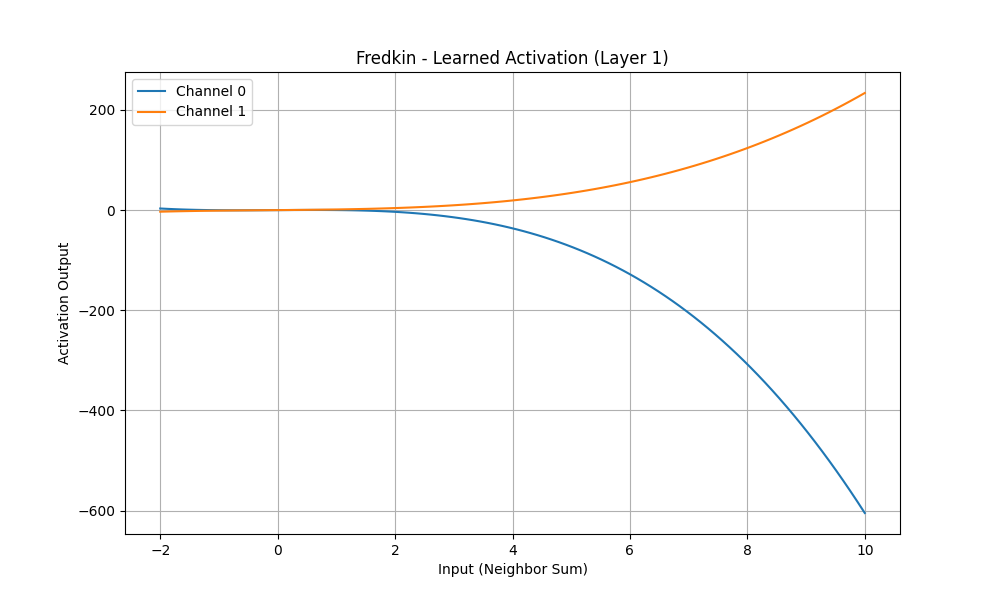

# Comparative Analysis of CA Learnability

## Executive Summary

This report analyzes the learnability of four CA rules **GoL**, **Replicator**, **Fredkin**, and **Morley** using NNs with learnable PolyKAN.

**Key Findings:**

1. **GoL** is easily learnable (100% acc) even with low-degree polynomials (Deg 2).
2. **Fredkin & Replicator** are significantly harder to learn, showing 0% acc in initial low-deg exp. This should supports the hypothesis that their parity/modulo based logic requires higher order representations or specific architectures not easily captured by standard sum based convolutions.
3. **Visualization** of the learned functions reveals clear "activation bumps" for Life (e.g., at neighbor cnt 3), whereas failed rules show flat or noisy activations.

## Methodology

### Model: PolyKAN

Replaced std ReLU activations with **Polynomial Activations**:

$$
\phi(x) = \sum_{i=0}^{d} w_i x^i
$$

This shows and allows the network to learn complex, non-monotonic functions (like the "birth" condition in Life) in a single layer.

### Rules Tested

- **GoL (B3/S23)**: Std complexity.
- **Replicator (B1357/S1357)**: Modulo-2 based (Parity).
- **Fredkin (B1357/S02468)**: Parity based.
- **Morley (B368/S245)**: Complex high-density rule.

## Experimental Results

### Success Rate Heatmaps

The following heatmaps show the success rate (fraction of trials achieving 100% test accuracy) across different model widths and depths.

#### GoL

**Degree 2:**

*High success rate indicates robust learnability*

**Degree 3:**


### Learned Function Visualization

Inpection shows the learned activation functions ($\phi(x)$) for the first layer. The x-axis represents the sum of neighbors.

#### GoL (Success)

The model learns a clear peak around $x=3$ (Birth) and maintenance around $x=2,3$ (Survival).


#### Replicator (Failure)

The learned functions are unable to capture the alternating parity logic ($1, 3, 5, 7$), resulting in failure.


#### Fredkin (Failure)

Similar to Replicator, the parity constraint poses a challenge.


## How to Run the Experiments

### 1. Installation

Install:

```bash
pip install torch torchvision torchaudio tqdm matplotlib pandas seaborn
```

### 2. Running Grid Search

To reproduce the heatmaps:

```bash
PYTHONPATH=. python comparative_experiments/train_heatmap.py
```

* Results are saved incrementally to `comparative_experiments/heatmap_results.jsonl`.

### 3. Generating Visualizations

To visualize the learned functions for a specific rule:

```bash
PYTHONPATH=. python comparative_experiments/visualize_functions.py --rule "Game of Life" --degree 3
```

### 4. Updating this Report

To process new results from the grid search:

```bash
PYTHONPATH=. python comparative_experiments/generate_report.py
```
