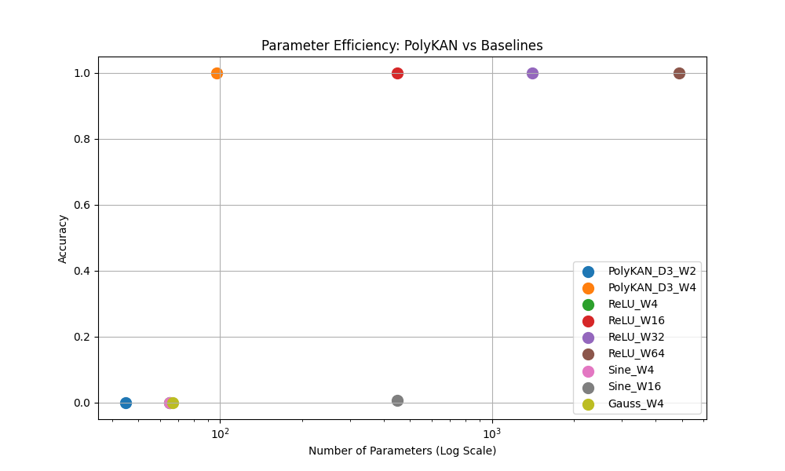

# Experiment 2: Activation Function Benchmarking

## Objective
To compare the parameter efficiency of PolyKAN against Standard CNNs (ReLU) and other baselines (Sine, Gaussian) for learning the GoL ($n=1$).

## Method
- **Task**: GoL 1-step prediction.
- **Metric**: Parameter Count required to achieve 100% acc.

## Results

| Model | Width | Parameters | Acc | Status |
| :--- | :--- | :--- | :--- | :--- |
| **PolyKAN (Deg 3)** | 2 | 45 | 0.0% | Failed |
| **PolyKAN (Deg 3)** | **4** | **97** | **100.0%** | **Efficient Success** |
| ReLU CNN | 4 | 65 | 0.0% | Failed |
| **ReLU CNN** | **16** | **449** | **100.0%** | **Baseline Success** |
| ReLU CNN | 32 | 1409 | 100.0% | Success |
| Sine CNN | 16 | 449 | 0.8% | Failed |

## Analysis
- **PolyKAN Efficiency**: PolyKAN solves the task with **97 parameters**.
- **ReLU Baseline**: The minimal ReLU network requires **449 parameters** (Width 16).
- **Comparison**: PolyKAN is approximately **4.6x more parameter-efficient** than ReLU for this task.
- **Fitting Power**: The polynomial activation allows a single neuron (filter) to learn the non-monotonic "Birth" function (peaks at 3), whereas ReLU neurons must be combined (overcomplete) to approximate this shape via piecewise linearity.
