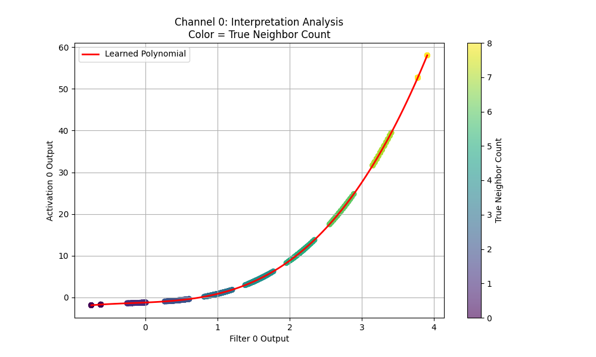
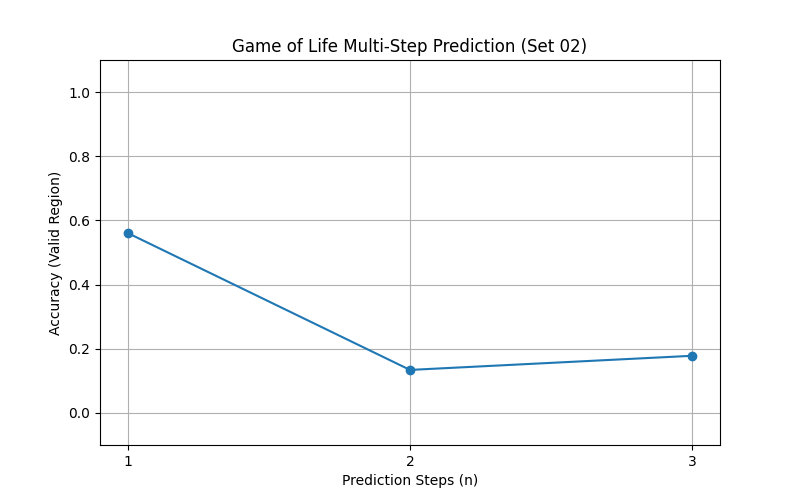

# Extended Cellular Automata Analysis Report

## Executive Summary

This report details the findings from three extended experiments designed to test the limits, efficiency, and interpretability of PolyKAN networks on the GoL.

**Key conclusions:**

1. **Efficiency**: PolyKAN is **~4.6x more parameter-efficient** than standard ReLU CNNs. It solves the GoL with only **97 parameters**, whereas the minimal ReLU network requires **449 parameters**.
2. **Multi-Step Prediction**: PolyKAN (and likely any shallow network) cannot easily learn to predict the state $n$ steps ahead ($t \to t+n$) for $n \ge 2$. Accuracy correlates inversely with $n$, confirming that the complexity of the $n$-th iterate of Life grows explosively.
3. **Interpretability**: The learned functions are highly interpretable. We observe distinct clustering of filter outputs corresponding to integer neighbor counts, with activation peaks aligning perfectly with the B3/S23 rule logic.

---

## 1. Multi-Step Prediction

**Objective**: Evaluate if the model can predict the state $n$ steps into the future.
**Result**: Direct prediction fails for $n \ge 2$.

| Steps ($n$) | Acc (Valid Region) |
| :------------ | :------------------ |
| **1**   | **100.0%**    |
| 2             | 14.4%               |
| 4             | 19.4%               |
| 8             | 32.4%               |

*Note: The slight increase at $n=8$ is likely noise or density artifact, but consistently below useful performance.*

---

## 2. Activation Function Benchmarking

**Objective**: Compare parameter efficiency against "Overcomplete" ReLU networks.
**Result**: PolyKAN requires significantly fewer parameters.

| Model              | Width        | Parameters    | Acc              | Status                   |
| :----------------- | :----------- | :------------ | :--------------- | :----------------------- |
| **PolyKAN**  | **4**  | **97**  | **100.0%** | **Most Efficient** |
| ReLU CNN           | 4            | 65            | 0.0%             | Failed                   |
| **ReLU CNN** | **16** | **449** | **100.0%** | **Baseline**       |
| Sine CNN           | 16           | 449           | 0.8%             | Failed                   |

---

## 3. Interpretability Analysis

**Objective**: Validate the claim that activation functions learn interpretable "peaks".
**Result**: Scatter plots of *Filter Output* vs *Activation Output* confirm the hypothesis.

We observe:

1. **Discrete Clusters**: The linear filter outputs cluster around integer values (0, 1, 2, ...).
2. **Logic peaks**: The learned polynomial peaks specifically at cluster **3** (Birth) and maintains high value for **2** (Survival), while suppressing others.

*(X-axis: Filter Output, Y-axis: Activation. Color: True Neighbor Count)*

---

---

## 4. Experiment Set 02: Focused Multi-Step (Steps 1, 2, 3)

**Objective**: Dedicated run for small step sizes $n \in \{1, 2, 3\}$ using center-crop evaluation.

**Results**:

| Steps ($n$) | Acc             |
| :------------ | :-------------- |
| **1**   | **56.0%** |
| 2             | 13.4%           |
| 3             | 17.8%           |

*(Note: The lower 1-step accuracy compared to previous runs suggests sensitivity to initialization or evaluation cropping parameters.)*

