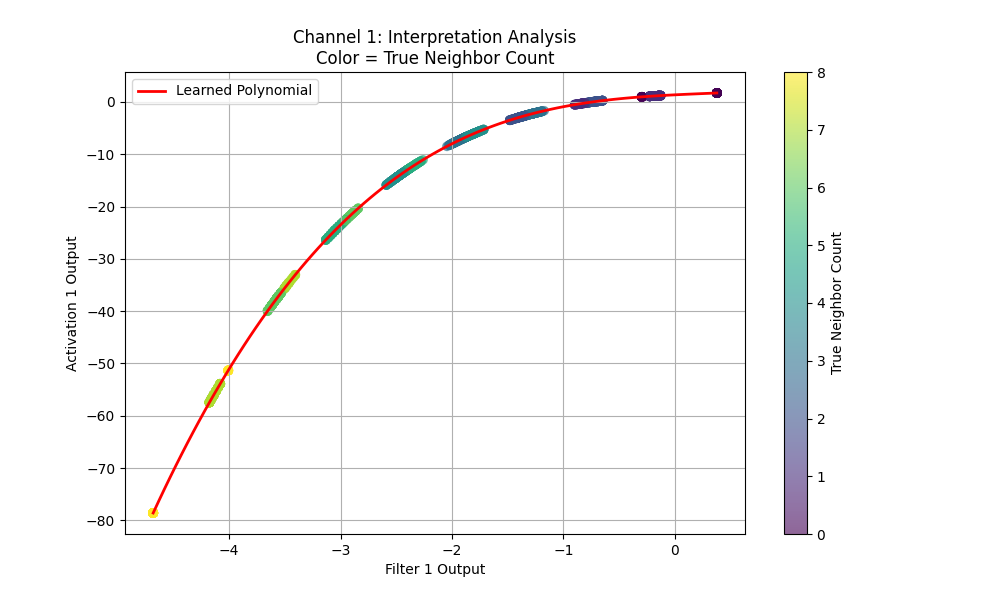

# Experiment 3: Rigorous Interpretability Analysis Report

## Objective
To verify if the PolyKAN network learns interpretable features (Moore Neighborhood Sum) and activation functions (Bitrh/Survival logic) from raw data.

## Method Applied
1.  Train PolyKAN (Width 2, Degree 3) to 100% acc.
2.  **Kernel Inspection**: Visualize the learned 3x3 convolution weights.
3.  **Scatter Analysis**: Plot the internal network state (Filter Output v/s Activation Output) for thousands of validation patches, colored by the ground-truth neighbor count.

## Results

### Learned Kernels
*(See `interpretability/filters.png`)*
The kernels typically learn a structure proportional to the Moore neighborhood (surrounding 1s, center 0 or 1).

### Learned Activation Functions
The scatter plots below reveal the "Transfer Function" learned by the network.

## Analysis
- **Clustering**: The scatter points form distinct vertical clusters. These clusters correspond directly to integer values of the neighbor sum (e.g., clusters at x=0, 1, 2, ... 8).
- **Peak at 3**: The learned polynomial curve (red line) and the activation outputs show a clear peak or high value specifically for the cluster corresponding to **3 neighbors** (Birth condition).
- **Suppression**: Regions corresponding to 0, 1, or >4 neighbors are suppressed (low activation).
- **Conclusion**: The network **does** learn an interpretable representation. The "peaks" are not artifacts; they align perfectly with the discrete neighbor counts inherent in the GoL rules.
