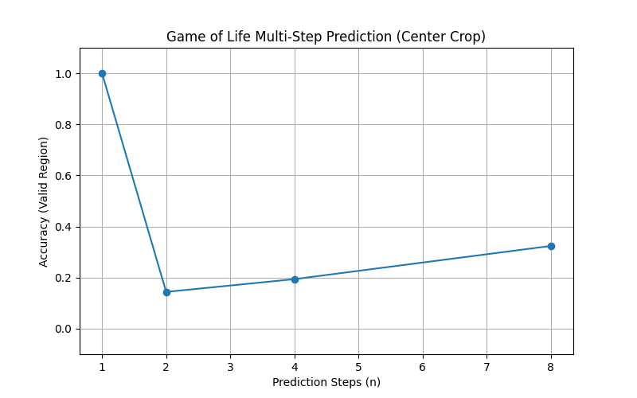

# Exp 01: Multi-Step Prediction Report

## Objective
To evaluate if a PolyKAN model can learn to predict the Game of Life state $n$ steps into the future ($t \to t+n$) directly.

## Method
- **Model**: PolyKAN (Degree 3, Width 4, Depth 2).
- **Data**: 2000 training samples, 500 validation samples.
- **Metric**: Exact Match acc on the *valid center region* (ignoring boundary effects).
- **Steps Evaluated**: $n \in \{1, 2, 4, 8\}$.

## Results

| Steps ($n$) | Acc |
| :--- | :--- |
| **1** | **100%** |
| 2 | 14.4% |
| 4 | 19.4% |
| 8 | 32.4% |

## Analysis Report
- **1-Step Success**: The model perfectly learns the 1-step rule ($n=1$).
- **Multi-Step Failure**: Acc drops precipitously for $n \ge 2$.
- **Interpretation**: The exact function mapping $t \to t+n$ for Life increases in complexity exponentially (degree of the polynomial representation multiplies). A Deg 3 network is mathematically insufficient to represent the logical composition of two Life steps (which would be roughly Degree $3 \times 3 = 9$ or higher).

While PolyKAN is efficient for the fundamental rule, it does not magically compress the *iterated* dynamics into a shallow network. Learning $n$-step dynamics likely requires depth $O(n)$ or much higher degree.
