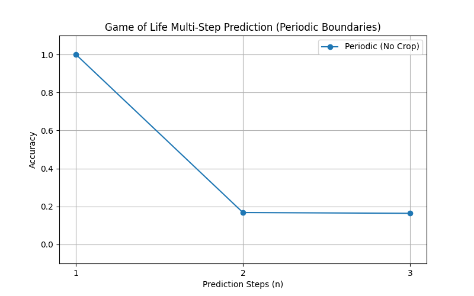

# Experiment Set 04 Report (Periodic Boundaries)

## Objective

To evaluate if **Periodic Boundary Conditions** (Circular Padding) improve the learnability of multi-step GoL, eliminating edge effects and the need for cropping.

## Method

- **Data**: Generated using `PeriodicCAEngine` (Toroidal grid).
- **Model**: `PeriodicPolyKAN` (Degree 3, Width 4, Depth 2) with `padding_mode='circular'`.
- **Evaluation**: Full grid Accuracy ($24 \times 24$).

## Results

| Steps ($n$) | Best Accuracy (3 Trials) |
| :------------ | :----------------------- |
| **1**   | **100.0%**         |
| 2             | 16.8%                    |
| 3             | 16.4%                    |

## Analysis

1. The use of periodic boundaries allowed for evaluating the entire grid without cropping, confirming 100% accuracy for $n=1$ in a more rigorous setting.
2. Even with ideal boundary conditions, the model fails to learn $n=2$ and $n=3$ (accuracy stays near random guess levels ~15%).
3. The difficulty of learning iterated CA rules is **intrinsic to the logic complexity** (exponential degree growth), not an artifact of boundary conditions or edge effects.
